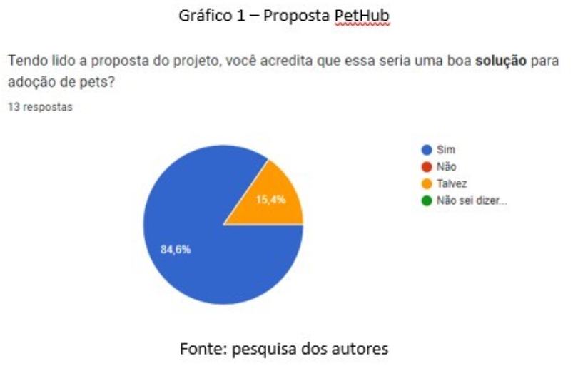
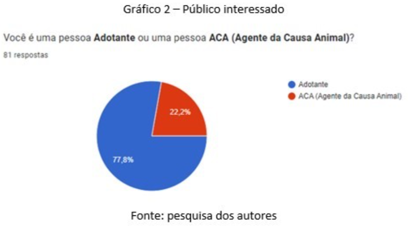

# Introdução

O processo de adoção é indispensável para diminuir a concentração de animais nas ruas das cidades e, consequentemente, baixar a incidência de zoonoses, proporcionando qualidade de vida para a população e os próprios animais. (SCHERER, 2021). Diante desse cenário, nota-se que a principal forma de adoção das pessoas é por meio de redes sociais (Instagram, Twitter, WhatsApp, Telegram e etc.), conforme comprovamos por uma pesquisa realizada pelo Google Forms. 

Os Agentes da Causa Animal (ACA – ONGs, abrigos e protetores independentes que resgatam e cuidam de animais), assim como as pessoas que querem adotar um pet, têm como obstáculo a descentralização das informações sobre animais nas plataformas digitais. 	Dessa forma, observa-se a necessidade de conectar essas pessoas e os ACAs a fim de facilitar a adoção de pets. 

## Problema
É notório que a dificuldade dos ACAs na divulgação de animais para adoção em várias plataformas digitais é um problema, da mesma maneira que pessoas interessadas em adotar tem dificuldade na busca por pets.
## Objetivos

O objetivo geral do projeto é criar uma plataforma para possibilitar o contato entre ACAs e protetores que resgatam e cuidam de animais e pessoas que tem interesse em adotar, ou seja, os futuros tutores.

Como objetivos específicos temos: 

- Disponibilizar, através da plataforma, um cadastro de ACAs e adotantes; 
- Permitir a criação de perfis dos animais disponíveis para adoção;
- Facilitar o gerenciamento dos ACAs e dos adotantes em relação ao interesse nos animais cadastrados. 

## Justificativa

Dados de 2022 da Organização Mundial de Saúde (OMS) apontam que existem, no Brasil, cerca de 30 milhões de animais abandonados. Entre esses, 20 milhões são cachorros e 10 milhões gatos. Um levantamento da Confederação Brasileira de Proteção Animal, feito em 2021, revela que, somente no DF, são cerca de 700 mil animais abandonados. Por que não se tornar uma das pessoas que oferece, além de um lar seguro, o amor e o acolhimento que esses pets tanto precisam? (Cabral A., Giló N, 2023)  

Em pesquisa realizada com um grupo de 81 pessoas, nos estados de São Paulo e Minas Gerais, entre os dias 14 e 23 de março de 2023, pelo Google Forms, fica claro a importância da construção de uma plataforma com a finalidade de facilitar a adoção de animais. 

## Público-Alvo

Temos dois tipos de usuários neste projeto: os adotantes e as ACAS. O tipo de adotante que temos como público-alvo são pessoas adultas, principalmente mulheres, entre 20 e 60 anos, que possuem uma renda fixa ou algum tipo de estabilidade trabalhista que possibilite a adoção de um animal de estimação de forma responsável e que forneça toda infraestrutura necessária para o seu bem-estar.  

Já as ACAs podem tanto ser ONGs ou abrigos com CNPJ como também pessoas protetoras independentes da causa animal. Se tratando do primeiro caso, o foco é em organizações com algum registro oficial de funcionamento, para garantir aos adotantes a seriedade destas instituições, enquanto que, se tratando de protetores independentes, o foco está em pessoas adultas, principalmente mulheres, com no mínimo 2 anos de atuação na causa animal que possa ser comprovada de alguma forma (redes sociais, testemunhas, etc)