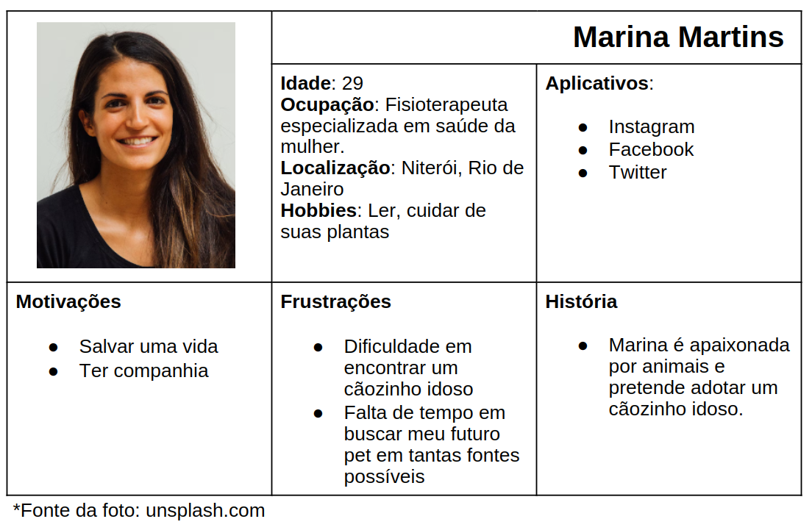
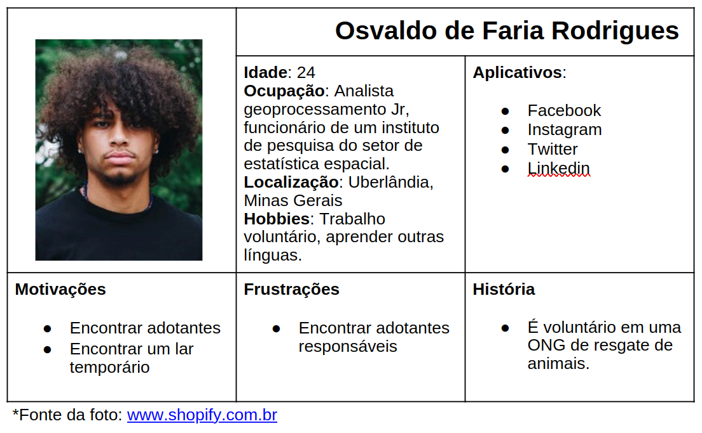
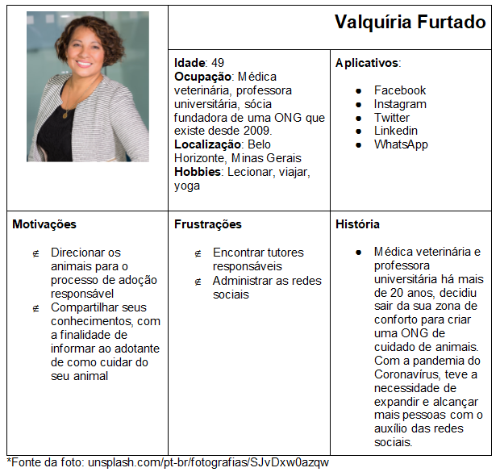
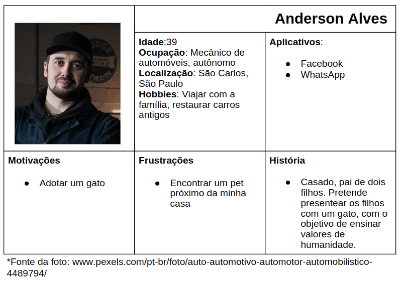

# Especificações do Projeto

A definição exata do problema e os pontos mais relevantes a serem tratados neste projeto foi consolidada com o uso de um formulário online divulgado nas redes sociais e por mensagem a pessoas conhecidas dos membros do grupo de forma a coletar as informações necessárias para construir não só as personas e histórias de usuários, como também as principais dores e necessidades dos nossos usuários. 

## Personas

As personas levantadas durante o processo de entendimento do problema são apresentadas nas Figuras que se seguem. 

## Histórias de Usuários

A partir da compreensão do dia a dia das personas identificadas para o projeto, foram registradas as seguintes histórias de usuários.:

|EU COMO... `PERSONA`| QUERO/PRECISO ... `FUNCIONALIDADE` |PARA ... `MOTIVO/VALOR`                 |
|--------------------|------------------------------------|----------------------------------------|
|Marina  | um meio confiável de encontrar um animal de estimação           | encontrar um cãozinho idoso para adotar                |
|Osvaldo       | quero ter certeza de que um adotante interessado é confiável                  | Ppara que o pet esteja em boas mãos no novo lar  |
|Valquíria       | poder anunciar pets pra adoção de forma simples e intuitiva                | facilitar meu dia a dia administrando minha ONG  |
|Osvaldo       | quero buscar um lar temporário confiável                 | para que um animal resgatado tenha suporte até que seja adotado definitivamente  |
|Anderson       | gostaria de encontrar meu futuro pet o mais próximo possível da minha casa                 | para agilizar o meu processo de adoção  |
|Marina       | ter o perfil completo dos pets que me interesso (constando sexo, porte, vacinado ou não, castrado ou não, etc)                 | para filtrar melhor as opções de pets dentro do perfil que eu quero  |
|Valquíria       | saber qual o perfil e histórico dos adotantes interessados nos pets anunciados pela minha ONG                 | facilitar a escolha de um futuro tutor ideal  |

## Requisitos

As tabelas que se seguem apresentam os requisitos funcionais e não funcionais que detalham o escopo do projeto.

### Requisitos Funcionais

|ID    | Descrição do Requisito  | Prioridade |
|------|-----------------------------------------|----|
|RF-001| Quando autenticado como adotante o site deve apresentar na página principal os pets que foram cadastrados de acordo com a localização do usuário por meio de uma API.  | MÉDIA | 
|RF-002| O site deverá apresentar na barra superior no canto direito, caso o usuário esteja autenticado, um menu contendo itens que o permitirá: acessar o perfil, navegar até os pets que já se interessou e encerrar a sessão. E caso não esteja logado deverá mostrar dois botões que o permitirá: navegar até a tela de cadastro ou navegar até a tela de login.    | ALTA |
|RF-003| O site deverá apresentar uma barra de busca que permitirá ao usuário filtrar os pets da página inicial por localização.   | MÉDIA |
|RF-004| O site deve apresentar para cada pet uma imagem possibilitando que o usuário clique nela e veja os detalhes sobre aquele pet.   | ALTA |
|RF-005| Ao clicar no botão descrito na RF-004, o site deverá apresentar uma ação de sucesso e mostrar os dados do ACA que cadastrou aquele pet.    | BAIXA |
|RF-006| O site deve apresentar uma tela de cadastro como adotante que solicitará ao usuário informações para preencher o seu perfil como adotante.    | ALTA |
|RF-007| O site deve apresentar uma tela de cadastro como ACA que solicitará informações para preencher o perfil como ACA.    | ALTA |
|RF-008| O site deverá ter uma tela para login, a fim de permitir que o usuário seja autenticado.     | ALTA |
|RF-009| Quando logado como ACA o site deverá mostrar uma tela administrativa que mostrará inicialmente os pets cadastrados por ele.      | ALTA |
|RF-010| O site deverá exibir uma barra superior ao ACA na qual no canto direito uma mensagem de saudação e no canto esquerdo um botão que abrirá um modal para cadastro do pet.       | ALTA |
|RF-011| O site deverá exibir ao ACA um modal solicitando informações para cadastro do pet.        | ALTA |
|RF-012| Ao clicar em uma foto de um pet na área administrativa do ACA, o site deve mostrar um modal semelhante ao descrito na RF-12, com as informações já cadastradas do pet, e exibir as opções de editar, marcar como adotado e excluir.         | ALTA |
|RF-013| O site deverá possuir uma tela que irá permitir ao ACA visualizar uma lista com as pessoas que demonstraram interesse em seus pets.          | ALTA |
|RF-014| Ao clicar em um item da lista citada na RF-14 o site deverá exibir um modal contendo as informações que o usuário adotante cadastrou conforme a RF-07.         | ALTA |

### Requisitos não Funcionais

|ID     | Descrição do Requisito  |Prioridade |
|-------|-------------------------|----|
|RNF-001| O site deve ser publicado em um ambiente acessível publicamente na Internet (Repl.it, GitHub Pages, Heroku); | ALTA | 
|RNF-002| O site deverá ser responsivo permitindo a visualização em um celular de forma adequada |  ALTA | 
|RNF-003| O site deve ter bom nível de contraste entre os elementos da tela em conformidade   |  MÉDIA | 
|RNF-004| O site deve ser compatível com os principais navegadores do mercado (Google Chrome, Firefox, Microsoft Edge)  |  ALTA | 
|RNF-005| O site deverá armazenar os dados dos usuários em local seguro a fim de evitar problemas com a Lei Geral de Proteção de Dados (LGPD)  |  ALTA | 

## Restrições

O projeto está restrito pelos itens apresentados na tabela a seguir.

|ID| Restrição                                             |
|--|-------------------------------------------------------|
|01| O aplicativo deve se restringir às tecnologias básicas da Web no Frontend  |
|02| A equipe não pode subcontratar o desenvolvimento do trabalho.        |
|03| O projeto não é responsável pela adoção final ou qualquer transporte de animal até o adotante.        |
|04| O projeto não terá solicitação de ajuda aos ACAs em relação de animais que foram encontrados.         |