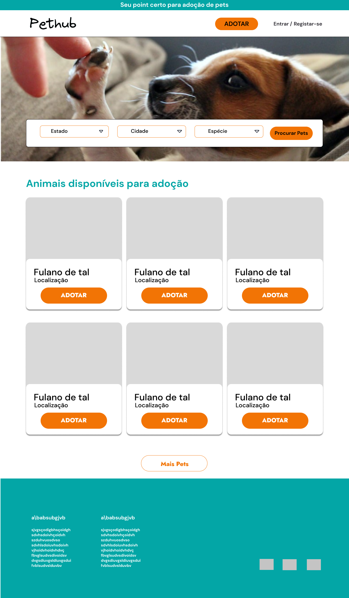

# Projeto de Interface

Dentre as preocupações para a montagem da interface do sistema, estamos estabelecendo foco em questões como agilidade, acessibilidade e usabilidade. Desta forma, o projeto tem uma identidade visual padronizada em todas as telas que são projetadas para funcionamento via web. 

## User Flow

O diagrama apresentado na figura abaixo mostra o fluxo de interação do usuário pelas telas do sistema. Cada uma das telas deste fluxo é detalhada na seção de Wireframes que se segue

> Disclaimer: ACA significa <strong>Agente da Causa Animal</strong> e foi o nome escolhido pelo grupo para representar todas as pessoas, ONGs e abrigos que fazem resgate e/ou cuidam de animais de estimação que precisam de um lar
## Wireframes

Utilizamos o figma para criação das telas da aplicação, prezando pela simplicidade e intuição na elaboração dos fluxos e na usabilidade dos nossos dois tipos de usuário: ACAs e Adotantes, buscando ao máximo solucionar suas principais dores na temática deste projeto.

A tela de homepage mostra, para usuários ainda não logados, diversos animais disponíveis para adoção, onde cada um deles é um card com a opção de ADOTAR. Essa opção ao ser clicada permite obter mais informações sobre o PET escolhido. Além disso, no cabeçalho existem as seguintes opções:
- filtrar a busca por localização e espécie
- cadastro para adotantes e ACAs
- login para usuários já cadastrados

Ao clicar em adotar, em um dos cards acima, é possível ver os detalhes daquele pet selecionado. 

Se clicar em "Tenho interesse", é enviado pra página de login, já que o usuário ainda não está logado.

Ainda na homepage deslogada, ao clicar no botão de "Cadastrar", que se encontra no cabeçalho, o usuário é enviado para um breve fluxo geral que é conveniente a ambos os tipos de usuário para depois selecionar seu tipo especifico de cadastro e então responder um formulário a ver com essa escolha - se é ACA ou adotante.

### Fluxo de ACA

Após selecionar ACA na tela final de cadastro, o usuario é redirecionado para uma tela mais especifica de dados pedindo para que as principais informações importantes sobre a instituição ou pessoa por trás dos futuros anuncios de pets na plataforma seja preenchida

Ao finalizar, é enviado para uma homepage com cabeçalho especifico para uma ACA

No cabeçalho da homepage existe um botão chamado "Conta", que ao clicar envia para uma página inicial com os pets cadastrados pela ACA. Nela você pode ver os detalhes de um pet já cadastrado e também cadastrar um novo pet.

Ao clicar em um destes cards, é possível ver os detalhes de um pet, além de marca-lo como adotado, remove-lo da lista ou editar os dados dele.

Ao clicar em editar, é enviado para uma página que contém um formulário com os principais campos necessários para se informar sobre um pet: raça, especie, sexo, idade, se é vermifugado, vacinado, castrado, etc. Esta página é a mesma pra quando se clica em Cadastrar pet, na tela inicial do menu da ACA.

Ao clicar para remover um pet, o usuário recebe como feedback um modal de sucesso sobre aquela remoção, que contém um botão que o permite voltar ao menu de pets cadastrados.

É possível para uma ACA ver as pessoas interessadas em seus pets, com o mesmo layout de cards em que ao clicar é possível ver detalhes deste adotante.

Ao clicar em um adotante, abre-se um modal com os detalhes desta pessoa interessada com contato e informações principais a fim da ACA poder entrar em contato para finalizar a adoção.

Ainda no menu principal da ACA, ele pode também ver e alterar os dados de sua conta, para atualizar algo caso seja necessário.

### Fluxo de adotante
Após selecionar adotante na tela final de cadastro, o usuario é redirecionado para uma tela mais especifica de dados em que é importante fazer perguntas de cunho mais pessoal sobre aquela pessoa. O objetivo é facilitar aos ACAs saberem quem são está interessado em seus pets e se essa pessoa está tem condições socio-financeiras de arcar com o custo de vida deste animal.

Ao finalizar, é enviado para uma homepage com cabeçalho especifico para uma ACA

Nesta homepage, o usuario pode buscar pelos pets que tem interesse filtrando por estado, cidade e espécie de animal (gato, cachorro, hamster, aves, etc). Ao clicar em algum pet, abre-se um modal com os detalhes deste pet.

Ao clicar em "Tenho interesse", abre-se outro modal de feedback de sucesso.

Esse modal tem um botão que abre um outro modal, desta vez de detalhes do pet salvo pelo usuário.

Na homepage da área logada do adotante, é possível no cabeçalho clicar em "Pets salvos" e assim entrar em uma página que contém todos os pets que o adotante se interessou e salvou para entrar em contato com a ACA depois.

Ao clicar em algum pet, o usuário poderá ver os detalhes deste pet, além dos dados da ACA responsável por ele, a fim de que possa entrar em contato e finalizar a adoção.

