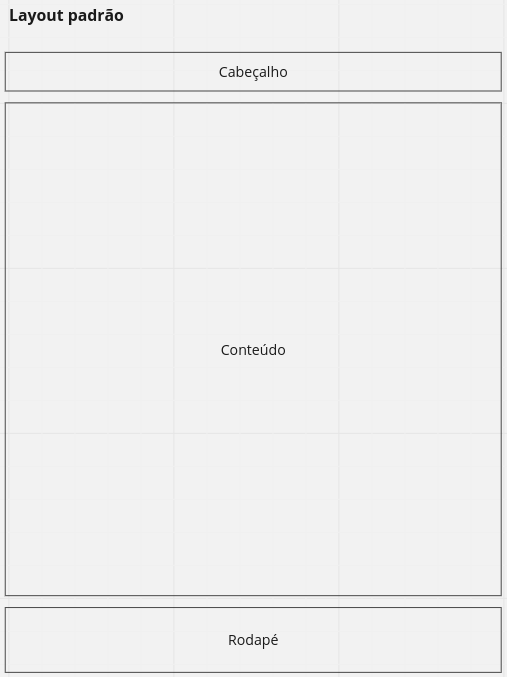
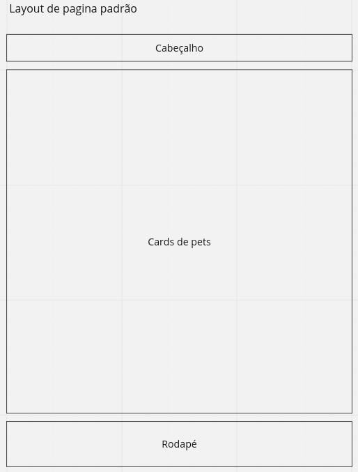
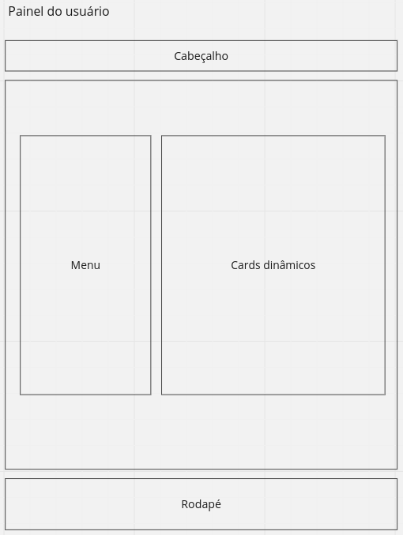
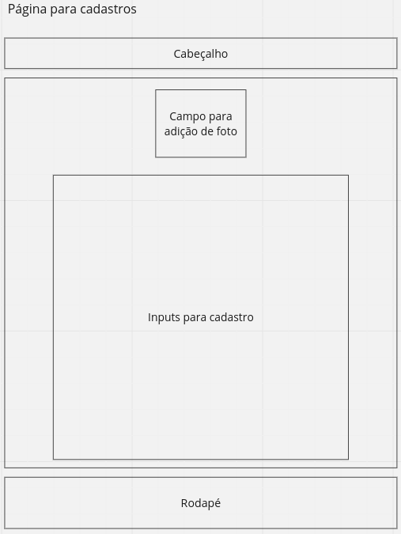
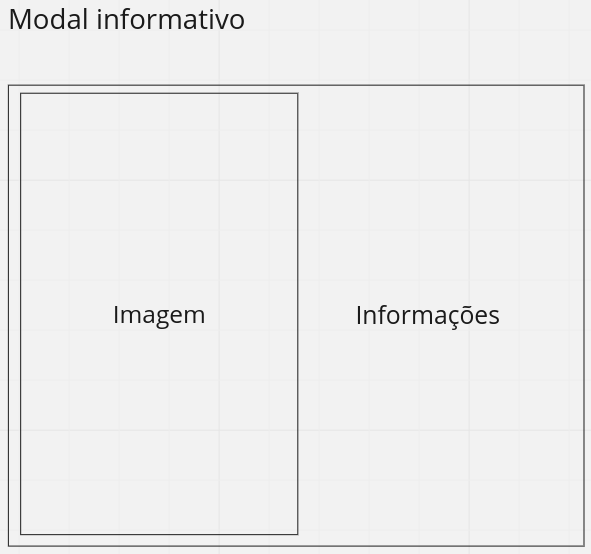
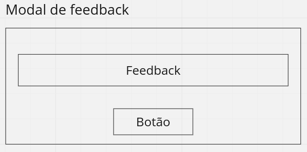

# Template padrão do site

O padrão de layout a ser utilizado pelo site tem correspondência ao projeto de Interface elaborado anteriormente, conforme imagem abaixo:

O template criado está disponível no repositório https://github.com/ICEI-PUC-Minas-PMV-ADS/pmv-ads-2023-1-e1-proj-web-t11-pmv-ads-2023-1-e1-proj-web-t11-03 e é composto pelos seguintes layouts: 

- Página padrão
- Painel do usuário
- Página de cadastros
- Modal informativo
- Modal de feedback

A responsividade segue o padrão do Bootstrap.

## Página padrão

Esse layout abrange as páginas em que é preciso ver os cards dos pets, seja na home deslogada, seja na home do adotante.

## Painel do usuário

Aqui pode tanto ser o painel de dados do adotante como também do ACA. Sempre terá este menu com opções à esquerda e terão cards à direita, que podem vir com infos de pets de interesse, pets cadastrados e adotantes, dependendo do tipo de usuário que estiver vendo o menu.

## Página para cadastros

Será possível fazer cadastro de adotante, de ACA e de pets, em todos os casos será o mesmo layout básico.

## Modal informativo

Basicamente todos os modais informativos da aplicação terão este mesmo padrão, em que à direita teremos uma imagem e à esquerda virão as informações necessárias, seja de pet seja de adotante. 

## Modal de feedback

Quando o usuário realiza uma ação que pode ocasionar em erro ou sucesso, mostraremos um modal que dará o feedback dessa ação.

