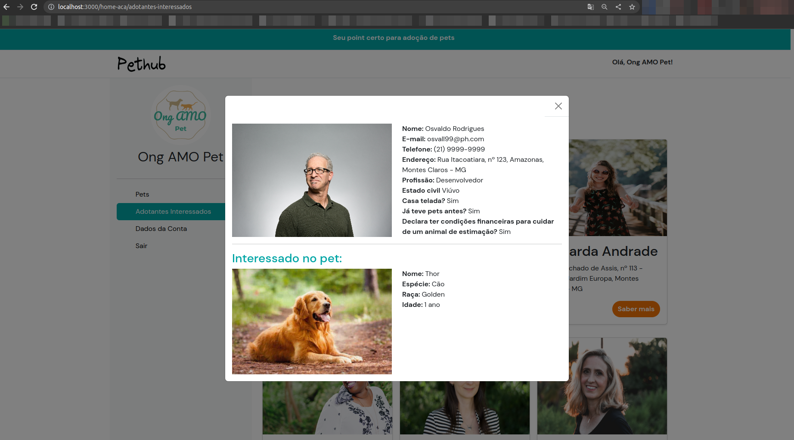

# Registro de Testes de Software

Abaixo encontram-se os registros dos testes do software PetHub.

### CT-XX - Visualizar página dos adotantes interessados (Visão ACA)

### CT-XX - Abrir modal ao clicar em adotante interessado (Visão ACA)

### CT-XX - Visualizar página de Login

[Tela de Login.webm](https://github.com/ICEI-PUC-Minas-PMV-ADS/pmv-ads-2023-1-e1-proj-web-t11-pmv-ads-2023-1-e1-proj-web-t11-03/assets/16339610/628a1a83-9dc9-476c-9d88-713a0958e0eb)
